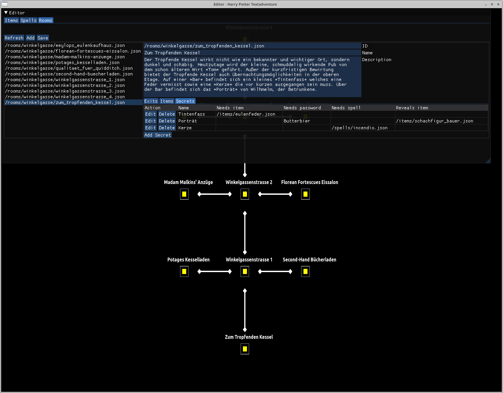
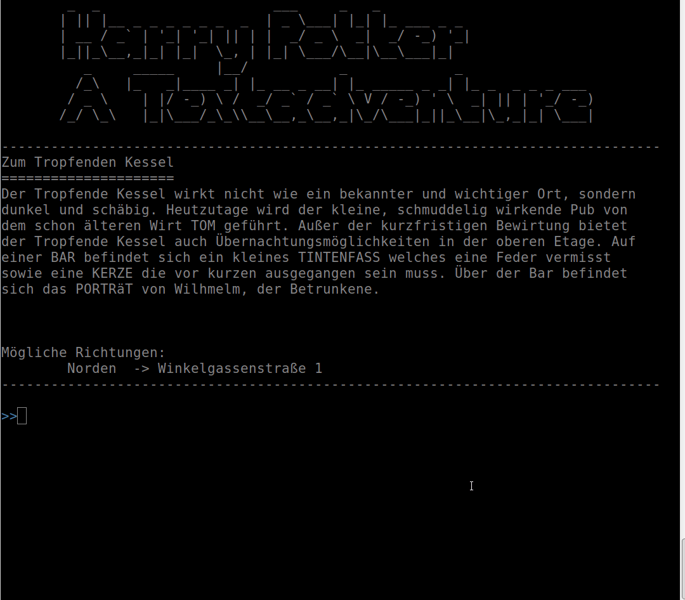
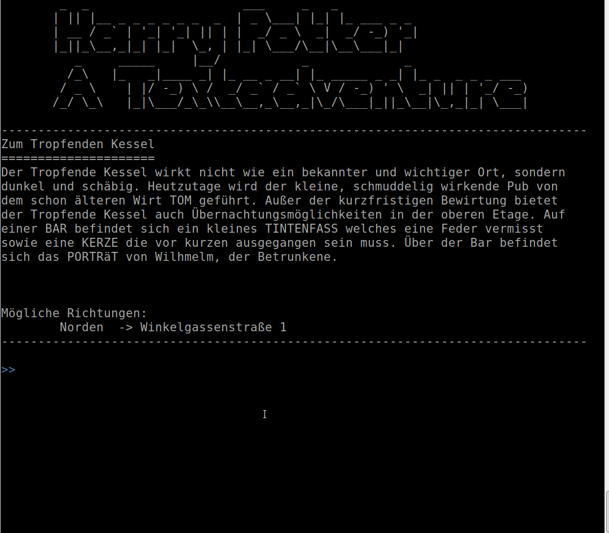
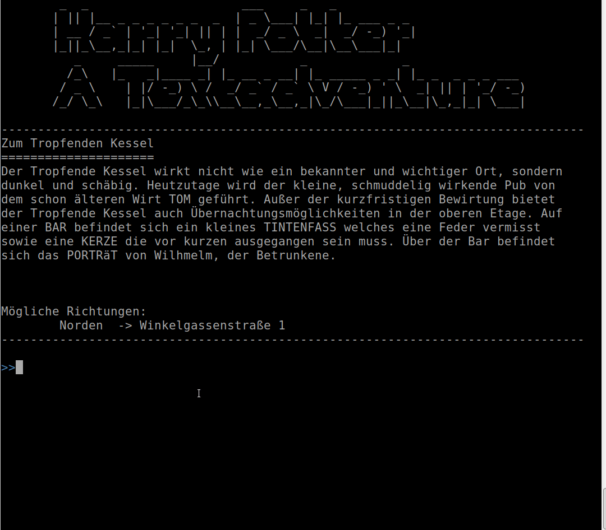

# Harry Potter Textadventure

Project State: Early Development

## Introduction
This is the implementation of a textadventure game engine including a graphical
editor to create and modify game files like rooms, items, spells and so on. 

The engine is basically designed for the harry potter universe but is that
flexible and generic that it can easily be used for other themed worlds too. 
Instead of scripting the behaviour of the world and surroundings, it is just 
configured by simple json files via the build in editor. So (besides of
compiling the binaries), no real programming knowledge is necessary to build
your own world. 

The gamefiles checked in in this repository are in german language and some
command implementations in the source code are also hardcoded to match the german language. 
So if you want to create your own adventure in english, just modify the gamedata
files and do some minor modifications in the `code/hpta-lib/**/commands/**`
files to match your language. 

## TODO's/Ideas
[ ] Save/Load of the game state  
[ ] Combat system  
[ ] Interaction with NPCs  
[ ] Minigames (etc. Wizard's Chess)

## Screenshots

---
### Editor

---
### Reveal Secret with item

---
### Reveal Secret with spell

---
### Reveal Secret with password
